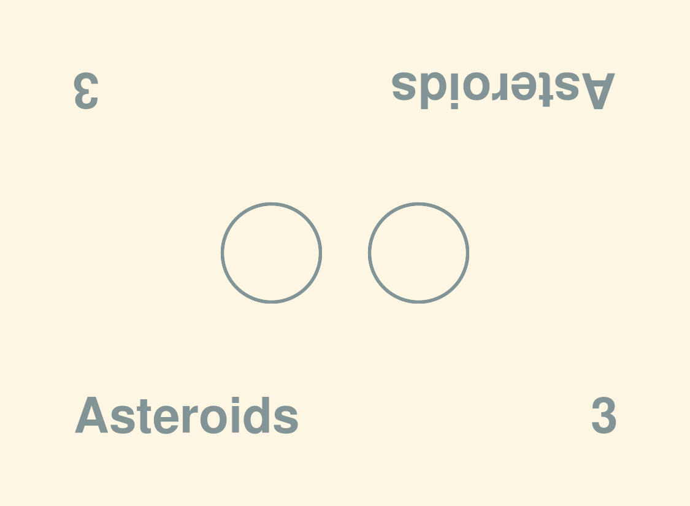
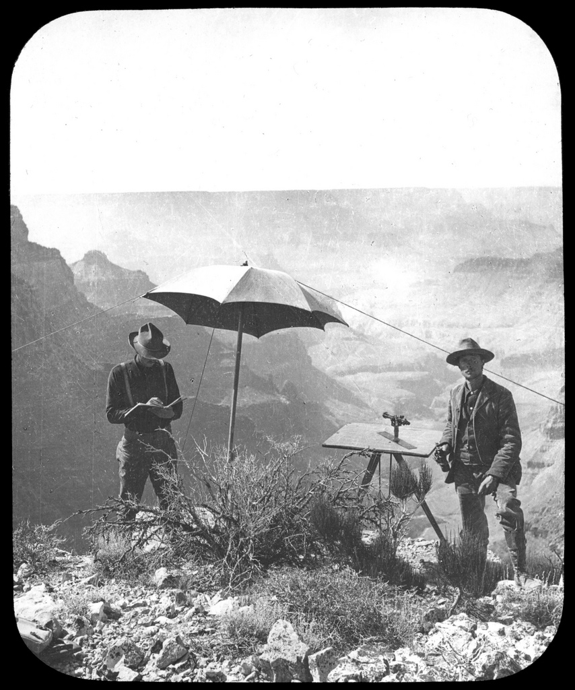
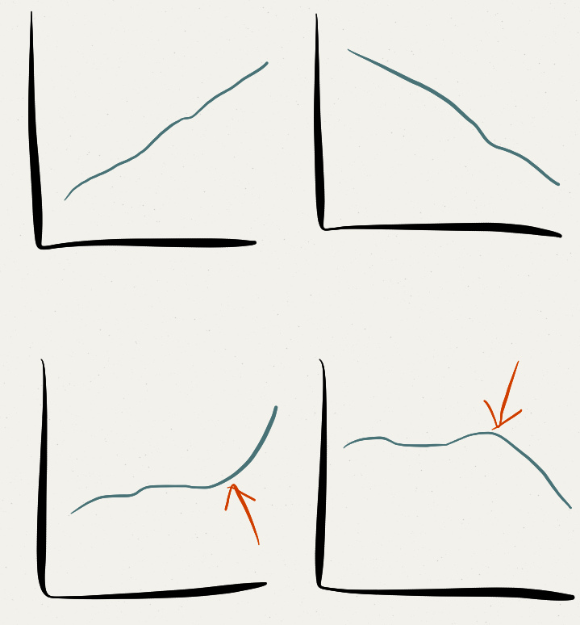
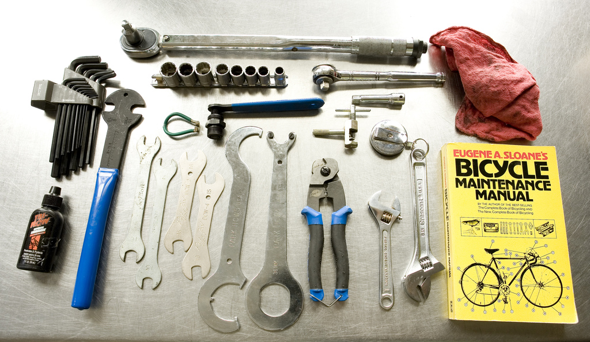

!SLIDE center
# API vs Game: FIGHT!
## geemus (Wesley Beary)

!SLIDE center
# open source
## excon
## fog
## ...

!SLIDE center
# hacker laureate @heroku
## api
## toolbelt
## ...

!SLIDE center
# Game Designer

## ...?

!SLIDE center
# What is driving?

!SLIDE center
# OMG, bear is driving.

!SLIDE center
# What forms the foundation?

!SLIDE center
# [insert color] listing.

!SLIDE center
# Onward!

!SLIDE center

# What came before?

!SLIDE center
# Standards, best practices.

!SLIDE center
# What limits can we set?

!SLIDE center
# <strike>YAGNI</strike> Goldilocks.

!SLIDE center
# Conform hardest.

!SLIDE center
# Postman principle.

!SLIDE center bullets incremental
# 3) Profit?
* If you build it;
* will they come?

!SLIDE center
# Your manual sucks.

!SLIDE center
# Duckling's Dilemma

!SLIDE center
# You forgot, like everything.

!SLIDE center
# Data driven iteration.

!SLIDE center
# Reduce, Reuse, Recycle.

!SLIDE center
# Share tools.

!SLIDE center
# Meditate.

!SLIDE center
# Share lessons.

!SLIDE center
# Thanks!
# Questions?

!SLIDE bullets small
# @geemus
## Credits (flickr.com/photos/[...])

  <ul>
    <li style="padding:0.5em">driven - relic/251832110</li>
    <li style="padding:0.5em">exceptions - two-wrongs/205467442</li>
    <li style="padding:0.5em">survey - grand_canyon_nps/7199079454</li>
    <li style="padding:0.5em">analysis - 49024304@N00/47244105/</li>
    <li style="padding:0.5em">postman - treehouse1977/5898734574</li>
    <li style="padding:0.5em">ducklings - taminator/3561436867</li>
    <li style="padding:0.5em">metrics - financialaidpodcast/7195300768</li>
    <li style="padding:0.5em">tools - bre/552152780</li>
    <li style="padding:0.5em">share - courosa/3708151311</li>
  </ul>

!SLIDE center
# Polymath FTW!
## P.S. I have ISRUs.
### P.P.S Find me for gaming!
